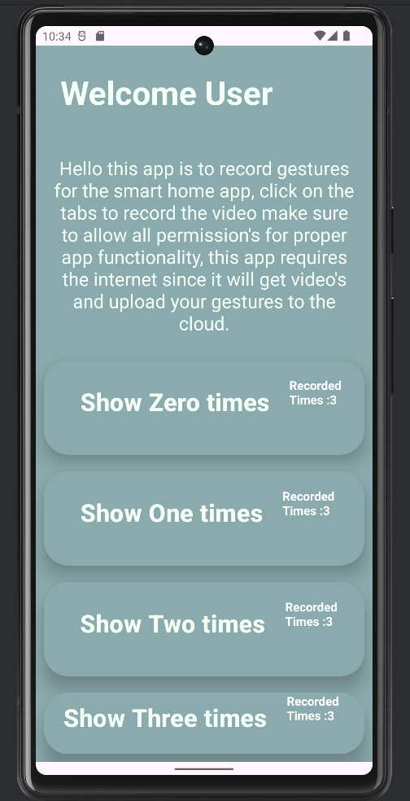
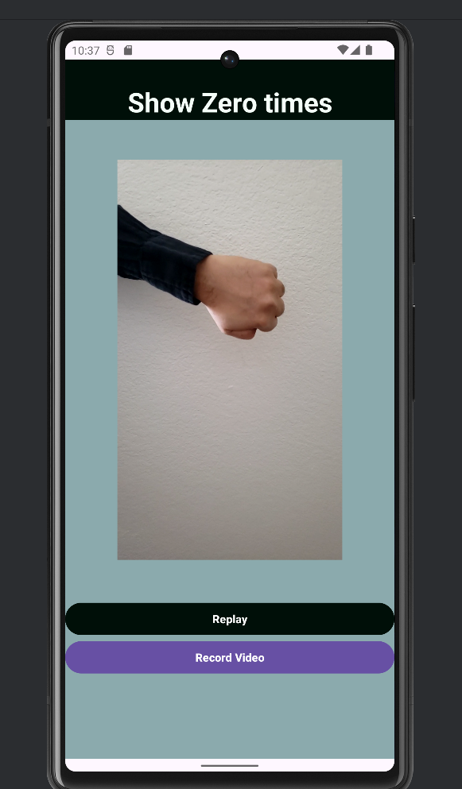

# Gesture Tutorial Android App

Welcome to the Gesture Tutorial Android App – a project developed using Android Studio and Java for learning and practicing gestures.

## Features

- **Video Tutorials:** Access instructional videos demonstrating different gestures.

- **Gesture Recording:** Record and replay your own gestures using the device's camera.

- **Cloud Storage:** Upload and retrieve recorded gestures securely.

- **Playback Functionality:** Review and analyze recorded gestures.

## Getting Started

1. Clone the repository to your local machine.
2. Set up Android Studio and ensure required dependencies are installed.
3. Explore the project structure and familiarize yourself with the code.

# UI 
## Home Screen

## Video Tutorial Screen

## Video Tutorial Screen

## License

This project is licensed under the [MIT License](LICENSE).

Embark on a journey to master the art of gestures with the Gesture Tutorial Android App. Happy coding!
